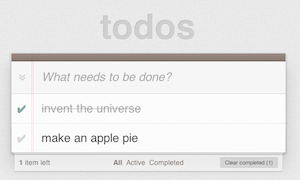

# HTML in Elm

Use HTML and CSS in Elm. I could tell you about how great it is, but the
example code and performance benchmarks speak for themselves.

Read more about how to use this library in [this post][html].

[html]: http://elm-lang.org/blog/Blazing-Fast-Html.elm

### Example

[][demo]

[demo]: http://evancz.github.io/elm-todomvc/

Check out the [source code][src]. It cannot get much simpler than that.

[src]: https://github.com/evancz/elm-todomvc/blob/master/Todo.elm

### Performance

[The benchmark][bench] shows that elm-html is really fast.

[bench]: http://evancz.github.io/todomvc-perf-comparison/

